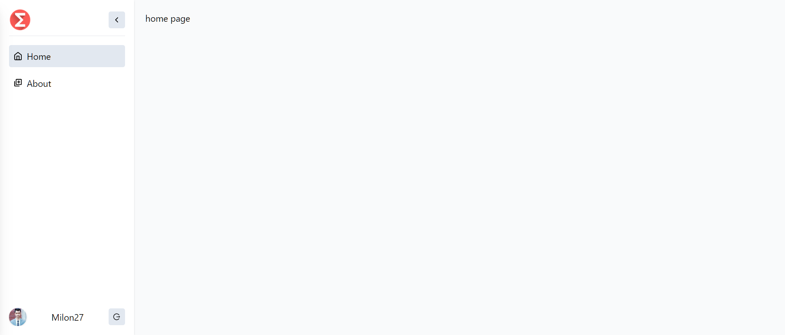
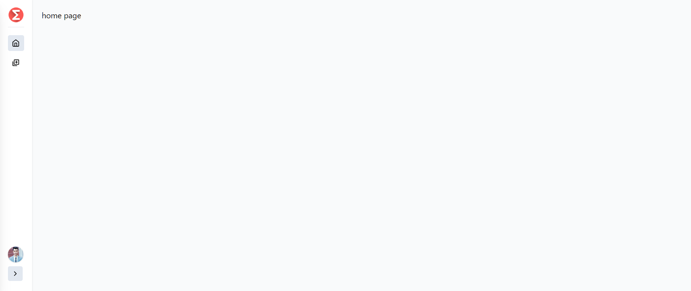
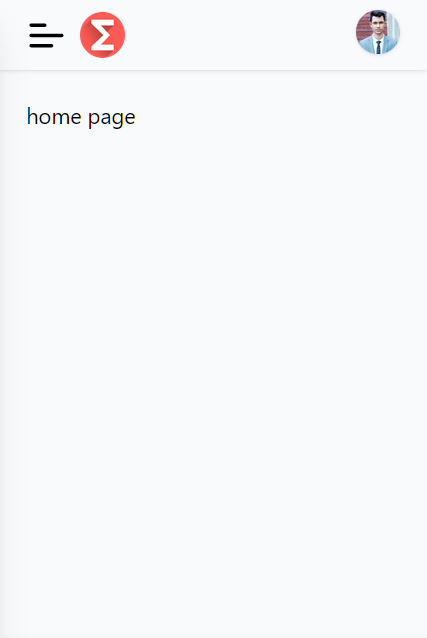
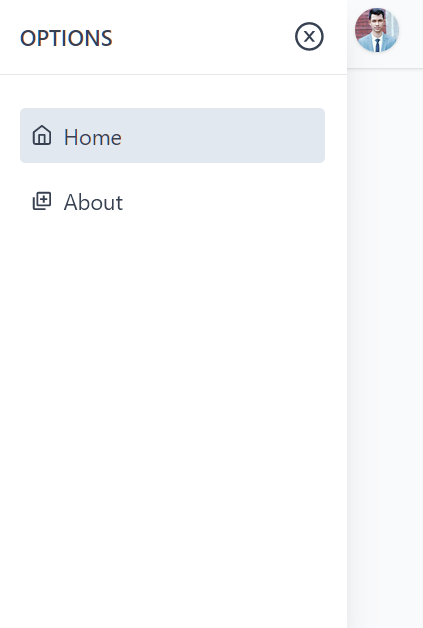

# React Sidebar

Compilable with both react js and next js.

## Installation Commands

```bash
npm install react-icons @milon27/react-sidebar
```

### How to use

1. Import css in main.js/ts or app.jsx or app.tsx.

```ts
import "../node_modules/@milon27/react-sidebar/dist/react-sidebar.css";
```

2. Customize main color with css variables

```css
/* if you are using tailwind */
@layer base {
  :root {
    --color-main: 34, 197, 94; /* main color */
    --color-main-foreground: 255, 255, 255; /*  main foreground color */
    --color-text: 64, 79, 101; /*  text color */
  }
}

/* if you are not using tailwind */
:root {
  --color-main: 34, 197, 94; /* main color */
  --color-main-foreground: 255, 255, 255; /*  main foreground color */
  --color-text: 64, 79, 101; /*  text color */
}
```

3. Use the component

> (React Js Project)

```tsx
import {
  FiBox,
  FiActivity,
  FiAirplay,
  FiAperture,
  FiList,
} from "react-icons/fi";
import { BrowserRouter, Route, Routes, NavLink } from "react-router-dom";
import {
  SidebarWrapper,
  PageWrapper,
  createReactNavLink,
} from "@milon27/react-sidebar";

const App = () => {
  const navItems: (() => JSX.Element)[] = [
    createReactNavLink(NavLink, "Options", "#", <FiBox />, [
      {
        icon: <FiList />,
        title: "List",
        to: "/list",
      },
      {
        icon: <FiActivity />,
        title: "Create New",
        to: "/create",
      },
      {
        icon: <FiAirplay />,
        title: "Edit Now",
        to: "/edit",
      },
    ]),
    createReactNavLink(NavLink, "About", "/about", <FiAperture />),
  ];

  return (
    <>
      <SidebarWrapper
        // header props
        logoUrl="https://cdn3.iconfinder.com/data/icons/logos-brands-3/24/logo_brand_brands_logos_chrome-512.png"
        title="Google"
        disableCollapse={false}
        hideBorder={false}
        // customHeader={
        //   <>{/* Replace logoUrl, title With your own custom component */}</>
        // }
        // footer start
        userName="Milon27"
        userImageUrl="https://avatars.githubusercontent.com/u/44096479?v=4"
        // customFooter={
        //   <div className="border w-full bg-black rounded-md flex text-white p-3 justify-between items-center">
        //     <button>Logout</button>
        //     <FiAirplay />
        //   </div>
        // }
        navItems={navItems}
        activeStyle="outline" // fill , outline
        onLogOut={() => {}} // wont work on custom footer
        onLogoClick={() => {}} // wont work on custom header
        onProfileImgClick={() => {}} // wont work on custom footer
      >
        <BrowserRouter>
          <Routes>
            <Route
              path="/"
              element={
                <PageWrapper className="bg-green">home page</PageWrapper>
              }
            />
            <Route
              path="/about"
              element={<PageWrapper>about page</PageWrapper>}
            />
          </Routes>
        </BrowserRouter>
      </SidebarWrapper>
    </>
  );
};
```

> (Next Js Project)

```tsx
// _App.js file
import "@milon27/react-sidebar/dist/react-sidebar.css";
import { SidebarWrapper, createNextNavLink } from "@milon27/react-sidebar";
import { FiBox, FiAperture } from "react-icons/fi";
import NextLink from "next/link";

function MyApp({ Component, pageProps }) {
  const navItems = [
    createNextNavLink(NextLink, "Home", "/", <FiBox />),
    createNextNavLink(NextLink, "Options", "#", <FiBox />, [
      {
        icon: <FiBox />,
        title: "List",
        to: "/list",
      },
      {
        icon: <FiBox />,
        title: "Create Now",
        to: "/create",
      },
    ]),
    createNextNavLink(NextLink, "About", "/about", <FiAperture />),
  ];

  return (
    <SidebarWrapper
    // ....
    // same props as React JS example
    >
      <Component {...pageProps} />
    </SidebarWrapper>
  );
}

export default MyApp;
```

> in other next js page

```jsx
// page/about.js
import { PageWrapper } from "@milon27/react-sidebar";
import React from "react";

export default function about() {
  return (
    <PageWrapper className="bg-green">
      <h1>about page</h1>
    </PageWrapper>
  );
}
```

> screenshot





